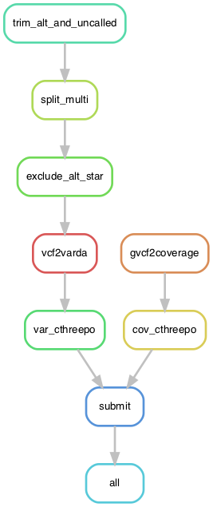

# Varda2 preprocessing

The Varda2 database stores genomic variants and coverage information. To enable
efficient and meaningful insertion into the database we have defined a set of
preprocessing steps that all participating centers should follow. Note that
these steps are not cast in stone and hopefully will converge as a set of best
practices between the centers.

The information about variants comes from VCF files and the information about
coverage comes from gVCF files. The following sections describe the process
in more detail.

## Workflow

The following figure depicts the process DAG generated from the Snakemake workflow at https://git.lumc.nl/klinische-genetica/capture-lumc/vcf-to-varda. The rules are described below. For all the details, look at the workflow itself.



## Variants

To extract variants from the VCF file in a way that Varda can process them, multiple steps are involved:

- trim_alt_and_uncalled:
  - `bcftools view --trim-alt-alleles --exclude-uncalled --output-file {output} {input}`
- split_multi:
  - `bcftools norm --multiallelics - --output {output} {input}`
- exclude_alt_star:
  - `bcftools view --exclude 'ALT==\"*\"' --output-file {output} {input}`

The first step is a pipeline of `bcftools` filtering and normalisation to get
rid of alt-alleles and multi-allelic entries so that we end up with a single
variant per line.

The second step is to take the filtered VCF file and convert it into a Varda
variant file.

- vcf2varda:
  - `vcf2variants < {input} > {output}`

The last step is only required if there are no proper refseq id's used, i.e. only `chr1` or even `1` instead of `NC_000001.10`.

- var_cthreepo:
  - `cthreepo --mapfile h37 --infile {input} --id_from uc --outfile {output} --id_to rs`

This outputs the following tab separated format:
`<CHROM> <START> <END> <PLOIDY> <PHASE SET> <INSERTED LENGTH> <INSERTED SEQUENCE>`

e.g.:
```
NC_000001.10    13656   13658   1       0       0       .
NC_000001.10    13895   13896   1       0       1       A
NC_000001.10    14164   14165   1       0       1       G
NC_000001.10    14672   14673   1       0       1       C
NC_000001.10    14698   14699   1       0       1       G
NC_000001.10    14906   14907   1       0       1       G
```

NB:
- `-1` in `PHASE SET` is homozygous, `0` is unphased
- `.` in `INSERTED SEQUENCE` is no insertion (thus deletion only)


## Coverage

To extract the coverage from gVCF files, the following steps are required.

- gvcf2coverage:
  - `gvcf2coverage < {input} > {output}`
- cov_cthreepo:
  - `cthreepo --mapfile h37 --infile {input} --id_from uc --outfile {output} --id_to rs`

The second step is only required if there are no proper refseq id's used, i.e. only `chr1` or even `1` instead of `NC_000001.10`.

This outputs the following tab separated format:

`<CHROM> <START> <END> <PLOIDY>`

e.g.:
```
NC_000001.10    10033   10038   2
NC_000001.10    10038   10043   2
NC_000001.10    10043   10044   2
NC_000001.10    10044   10048   2
NC_000001.10    10048   10049   2
NC_000001.10    10049   10050   2
NC_000001.10    10050   10051   2
NC_000001.10    10051   10054   2
```


N.B. By default the tools merge the resulting entries with a default merging
distance of 0. If merging is disabled, it is recommended to immediately pipe
the results of gvcf2coverage(.py) to `bedtools merge` to merge all the
individual adjecent entries. Note that bedtools will also merge the entries
with a different value in the ploidy column, therefore we opted to do the
merging in the gvcf2coverage tool.

N.B. This repository contains two functionally similar implementations of a coverage
extractor from gVCF files. The Python version is more readable and apt for modification, but the C version
is roughly 12x faster.

N.B. When a field that is specified using the `-f` flag is not present, the
threshold will be applied to the `DP` field as a fall-back.

## Submitting to the Varda database

After the variants and coverage files are created per sample, they need to be submitted using the varda2-client in the following way. The `varda2-client` expects the supplied access token to be present in the `VARDA_TOKEN` environment variable.

```
varda2-client submit \
--disease-code {params.disease_code} \
--lab-sample-id {params.sample_id} \
--coverage {input.coverage} \
--variants-file {input.variants} \
> {output}
```

This results in a JSON file with the following format:
```
{
"<LAB_SAMPLE_ID>": {
    "message": "Sample being inserted ...",
    "sample": "<VARDA_SAMPLE_ID>",
    "task": "<TASK_SAMPLE_ID>"
  }
}
```

## Software

- gvcf2coverage:
  - repo: https://github.com/varda/varda2_preprocessing
  - conda: https://anaconda.org/bioconda/gvcf2coverage
  - container: https://quay.io/biocontainers/gvcf2coverage
- pygvcf2coverage:
  - repo: https://github.com/varda/varda2_preprocessing
  - pypi: https://pypi.org/project/pygvcf2coverage/
  - conda: https://anaconda.org/bioconda/pygvcf2coverage
  - container: https://quay.io/biocontainers/pygvcf2coverage  
- vcf2variants:
  - repo: https://github.com/varda/varda2_preprocessing
  - pypi: https://pypi.org/project/vcf2variants/
  - conda: https://anaconda.org/bioconda/vcf2variants
  - container: https://quay.io/biocontainers/vcf2variants
- cthreepo:
  - repo: https://github.com/vkkodali/cthreepo
  - pypi: https://pypi.org/project/cthreepo/
  - conda: https://anaconda.org/bioconda/chtreepo 
  - container: https://quay.io/biocontainers/cthreepo
- varda2-client:
  - repo: https://github.com/varda/varda2-client
  - pypi: https://pypi.org/project/varda2-client
  - conda: https://anaconda.org/bioconda/varda2-client
  - container: https://quay.io/biocontainers/varda2-client
- bcftools:
  - repo: https://github.com/samtools/bcftools
  - conda: https://anaconda.org/bioconda/bcftools
  - container: https://quay.io/biocontainers/bcftools


  
